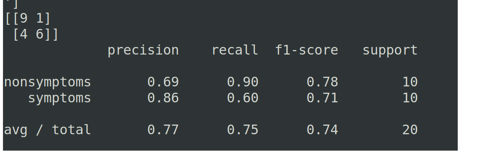
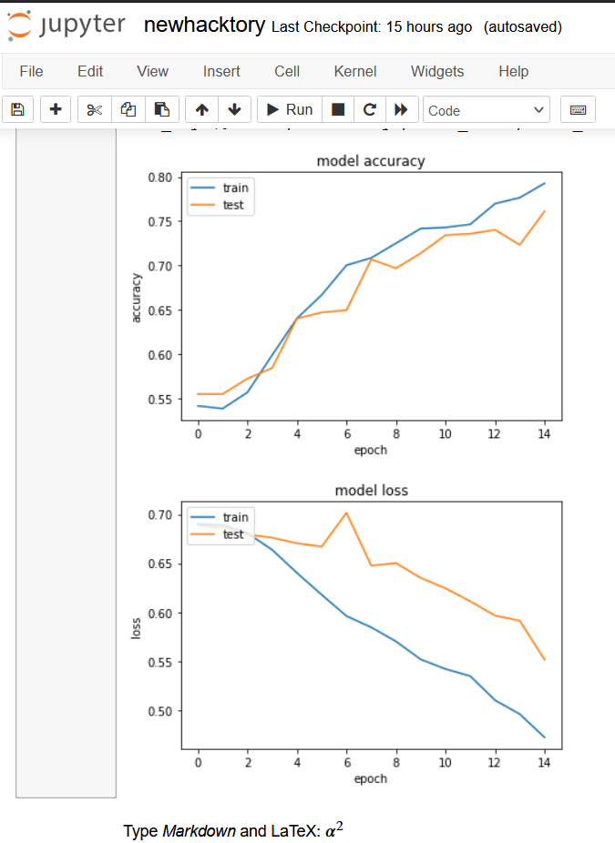

# diabetic-retinopathy
Automated Diabetic Retinopathy Diagnosis using Deep Learning 
project can classify retina images if it has diabetic retinopathy or not.

### Installation

#### For training the model and customizing.

1. Clone the repository
2. Download the dataset, either the [subset](https://github.com/Nomikxyz/retinopathy-dataset) 
3. Arrange the dataset into Symptoms and Non Symptoms according to Keras 
4. Run the Jupyter notebook.
5. Model will be saved as model.hd5.

Alternatively, you can use our pretrained model by loading the model.hd5.

### Results

The training converged to an accuracy of about 80%. With the validation scores for a small test set generated as,

The training data was generated as, 
<table style='margin:0px'><tr><td></td></tr></table>

Since we used the subset of our dataset(scaled down to 64*64) for faster training, we had some limitations in getting higher accuracy. Also using advanced architectures like the [inception v3](https://arxiv.org/abs/1512.00567) will boost up our accuracy and help predicting with minimised True negatives.
